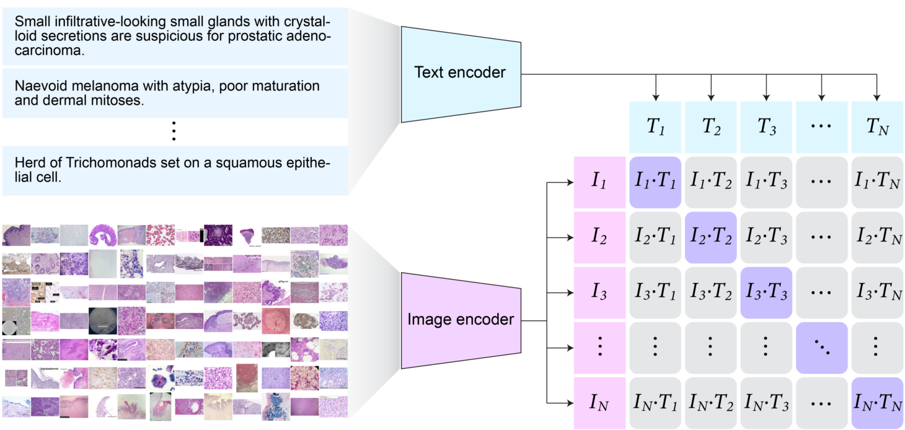

# Pathology Language and Image Pre-Training (PLIP)

PLIP is the first vision and language foundation model for Pathology AI. 




## Links
- [Official huggingface website](https://huggingface.co/spaces/vinid/webplip)
- [PLIP model (huggingface transformers)](https://huggingface.co/vinid/plip)
- [Preprint](https://www.biorxiv.org/content/10.1101/2023.03.29.534834v1)


### Internal API Usage

```python
    from plip.plip import PLIP
    import numpy as np
    
    plip = PLIP('vinid/plip')
    
    # we create image embeddings and text embeddings
    image_embeddings = plip.encode_images(images, batch_size=32)
    text_embeddings = plip.encode_text(texts, batch_size=32)
    
    # we normalize the embeddings to unit norm (so that we can use dot product instead of cosine similarity to do comparisons)
    image_embeddings = image_embeddings/np.linalg.norm(image_embeddings, ord=2, axis=-1, keepdims=True)
    text_embeddings = text_embeddings/np.linalg.norm(text_embeddings, ord=2, axis=-1, keepdims=True)
```

### HuggingFace API Usage

```python

from PIL import Image
import requests
from transformers import CLIPProcessor, CLIPModel

model = CLIPModel.from_pretrained("vinid/plip")
processor = CLIPProcessor.from_pretrained("vinid/plip")

image = Image.open("images/image1.jpg")

inputs = processor(text=["a photo of label 1", "a photo of label 2"],
                   images=image, return_tensors="pt", padding=True)

outputs = model(**inputs)
logits_per_image = outputs.logits_per_image  # this is the image-text similarity score
probs = logits_per_image.softmax(dim=1)  
print(probs)
image.resize((224, 224))


```

